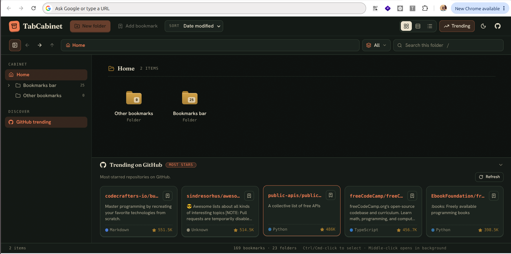
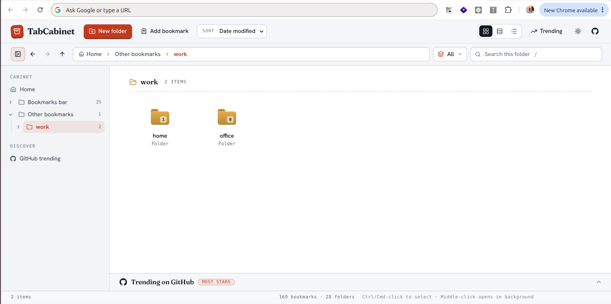
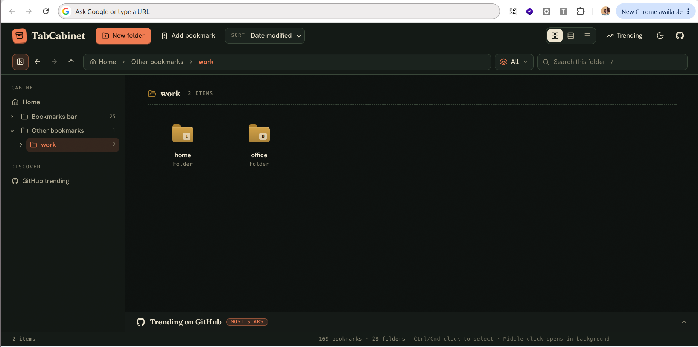
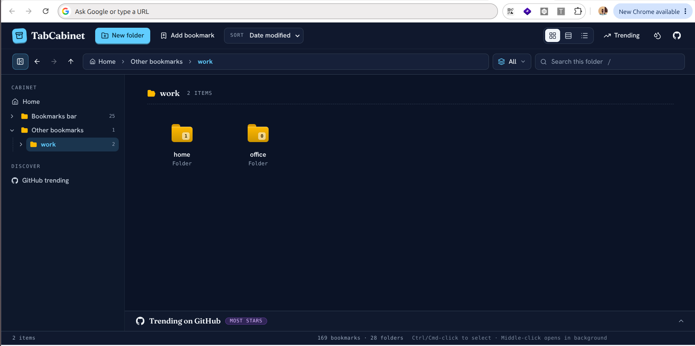
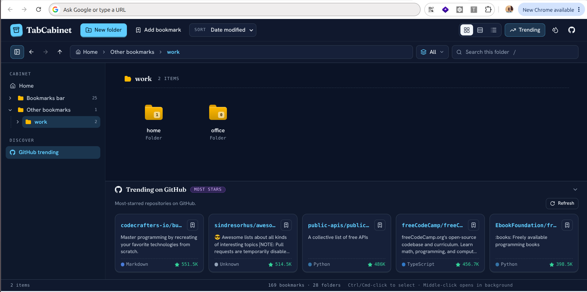

<div align="center">

# 🗄️ TabCabinet

**Your Chrome bookmarks, organized like folders, on every new tab.**

TabCabinet turns the new tab page into a clean file-explorer for your bookmarks, with the five most-starred GitHub projects waiting underneath.



</div>

---

## ✨ What you get

- 📂 **Your bookmarks, right where you need them.** Open a new tab and your folders are already there. No digging through menus.
- 🔎 **Find anything fast.** Search looks inside the folder you are in and every folder below it.
- 🧹 **Keep things tidy.** Create, rename, move and delete folders and bookmarks. Right-click anything for the full menu.
- 👀 **Pick the view you like.** Large icons, tiles, or a detailed list. Sort by name, site or date.
- 🎨 **Three themes.** Light, Dark and Fluent blue. One click on the toolbar switches between them.
- ⭐ **Discover great projects.** A drawer shows the five most-starred repositories on GitHub. Save any of them to your bookmarks in one click.
- 🔄 **Always up to date.** Add a bookmark anywhere in Chrome and it appears here instantly.

## 🖼️ Themes

<div align="center">

<table>
  <tr>
    <td align="center"><strong>Light</strong></td>
    <td align="center"><strong>Dark</strong></td>
    <td align="center"><strong>Fluent blue</strong></td>
  </tr>
  <tr>
    <td align="center">
      
    </td>
    <td align="center">
      
    </td>
    <td align="center">
      
    </td>
  </tr>
</table>

</div>

## 🚀 Get started

1. [**Download** the latest TabCabinet zip from the **Releases** page and unzip it.](https://github.com/zoomi-raja/TabCabinet/releases/latest)
2. In Chrome, go to `chrome://extensions`.
3. Turn on **Developer mode** (top right).
4. Click **Load unpacked** and pick the unzipped folder.
5. Open a new tab. That's it. 🎉

<details>
<summary>Prefer to build it yourself?</summary>

You need [Node.js](https://nodejs.org) installed.

```bash
npm install
npm run build
```

Then follow steps 2–5 above, choosing the `dist` folder.

</details>

> [!NOTE]
> Chrome lets only one extension control the new tab page. If yours doesn't change, another extension is in charge. TabCabinet will show you a warning and a list of extensions you can turn off.

## 🖱️ How to use it

| You want to…                | Do this                                                         |
| --------------------------- | --------------------------------------------------------------- |
| Open a bookmark             | Click it                                                        |
| Open it in a background tab | Middle-click it                                                 |
| Open a folder               | Double-click it (or select it and press Enter)                  |
| Select several items        | Hold Ctrl (Cmd on Mac) and click each one                       |
| Delete several items        | Select them, right-click one, choose **Delete**                 |
| Rename, cut, paste, delete  | Right-click a folder or bookmark, in the list or in the sidebar |
| Search                      | Press `/`, then type                                            |
| Go back, forward or up      | Use the arrows next to the address bar                          |
| Switch theme                | Click the theme button on the toolbar                           |
| Save a GitHub project       | Click the bookmark icon on its card                             |



## 🔒 Your privacy

- Your bookmarks stay on your computer. TabCabinet only reads and edits what Chrome already stores.
- It does **not** see your open tabs or browsing history.
- The only thing it fetches from the internet is the list of most-starred GitHub projects, which it remembers for an hour.

## ❓ Questions

**Why is there a "Customize Chrome" button in the corner?**
That button belongs to Chrome and appears on every extension-controlled new tab page. Extensions can't remove it.

**Is "most starred" the same as "trending on GitHub"?**
Not quite. GitHub offers no official trending list, so TabCabinet shows the most-starred repositories of all time. They change rarely.

**Can I lock a folder with a password?**
No. Chrome has no way to lock bookmarks, so TabCabinet doesn't claim to hide them.

**Will deleting a folder remove my bookmarks for good?**
Yes, deleting a folder removes everything inside it from Chrome. TabCabinet asks you to confirm first.

**Can I copy a whole folder?**
Not yet. You can move a folder (cut and paste) and copy single bookmarks.

## 📄 License

TabCabinet is free and open source under the [MIT License](LICENSE). You can use, copy, modify and share it, as long as the copyright notice stays with it.

---

<div align="center">

If TabCabinet makes your new tab nicer, a ⭐ on the repo helps others find it.

</div>
